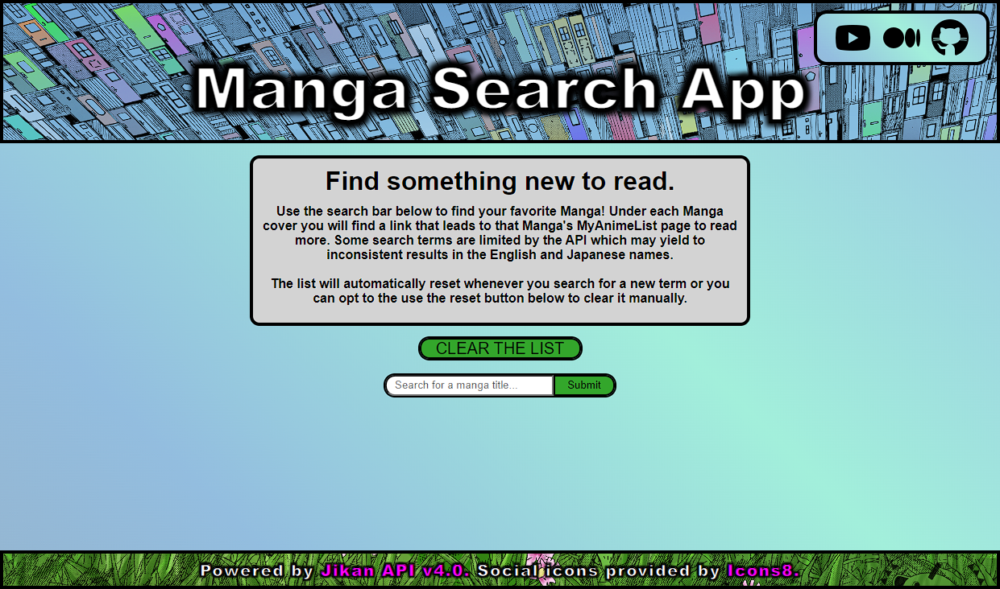
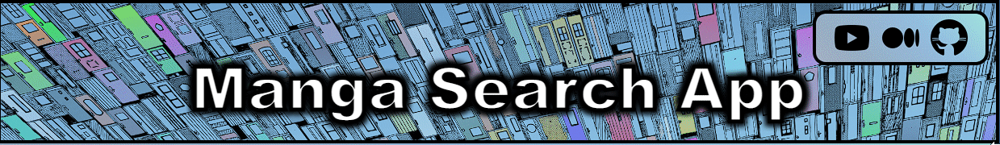

# Manga Search App
## Welcome to my Phase 1 project  at Flatiron School's Software Engineering Program!

---

## Description
As part of our phase 1 project we were prompted to create a single page web app that uses HTML/CSS/JS for the frontend and relies on a public API for the data.  The app features multiple event-listeners and relies on the use of the JS methods `.map` and `.forEach`.

Over the past few months I have a new found admiration for the manga and anime universe. I was always adjacent to the broad fandom but never fully immersed myself until a friend of mine insisted that I borrow his first volume of Berserk.  When researching some public API lists I came across the [Jikan API](https://docs.api.jikan.moe/) and I thought the timing could not have been more perfect. 

Once the functionality of the app was taken care of I spent quite some time playing with the CSS to try and get the app to as closely match my mental image as possible.  I hope you enjoy browsing it!  Feel free to read more about this project and others at my [Medium blog](https://medium.com/@t.ismailgeci/phase-1-project-getting-my-feet-wet-in-the-coding-world-d4c193c3afb5).

---
## Deployment

The app is currently being hosted on [GitHub](https://gecitgit.github.io/Phase-1-AM-Project/). 

---
## App usage with screenshots

Here is the main landing page of the app:

---

Users can search for whatever they'd like. Some searches are limited by the API due to an imperfect tagging system on MyAnimeList where the API scrapes all of the data from.  Each search creates a new `
` holding some relevant information like the cover, a summary, the author, general fan rating, the series status, and finally a link to the official [MyAnimeList](https://myanimelist.net/) link for that manga.

---

You can use the green button above the search bar to clear all of the entries from the list:

---

The `H1` tag at the top of the page holding the title has hover effects to change the background:

---

Finally the socials tab in the top right corner features links to a Youtube demo, my Medium post about this project and finally the very GitHub repo you're currently looking at!  The background of the box also uses the same animated gradient as the main page.

---
## Credits

All data for the site is provided by the [Jikan API](https://docs.api.jikan.moe/).

The icons for [Youtube](https://icons8.com/icon/set/youtube/ios-filled), [Medium](https://icons8.com/icon/set/medium/ios-filled), and [GitHub](https://icons8.com/icon/set/git/ios-filled) all provided by [Icons8](https://icons8.com/).

The artwork behind the title is the two-page spread at the end of chapter 63 of the Chainsaw Man manga.  The colored version was fan art found on [this Reddit thread](https://www.reddit.com/r/ChainsawMan/comments/hskbbe/i_tried_colouring_this_panel/) created by [/u/Ahmedala100](https://www.reddit.com/user/Ahmedala100/).  The artwork was then run through an app on [PINETOOLS](https://pinetools.com/grayscale-image) to convert it to grayscale for use in the hover events.

Feel free to reach out to me via GitHub with any questions and please do as you wish with the app!